<div align="center">

# Yoltec

### Consultorio médico universitario con inteligencia artificial

Plataforma integral (web + móvil) para la gestión de citas, recetas y pre-evaluación de síntomas con IA, desarrollada para el consultorio del **Instituto Tecnológico Superior de Ciudad Valles (ITSV)**.

[](https://laravel.com)
[](https://angular.dev)
[](https://flutter.dev)
[](https://python.org)
[](https://neon.tech)
[](LICENSE)

**[ Demo en vivo ](https://yoltec.vercel.app)** · **[ APK Android ](https://github.com/NestorMCastilloB/Yoltec/releases)** · **[ Documentación ](docs/)**

</div>

---

<div align="center">
<table>
<tr>
<td width="50%">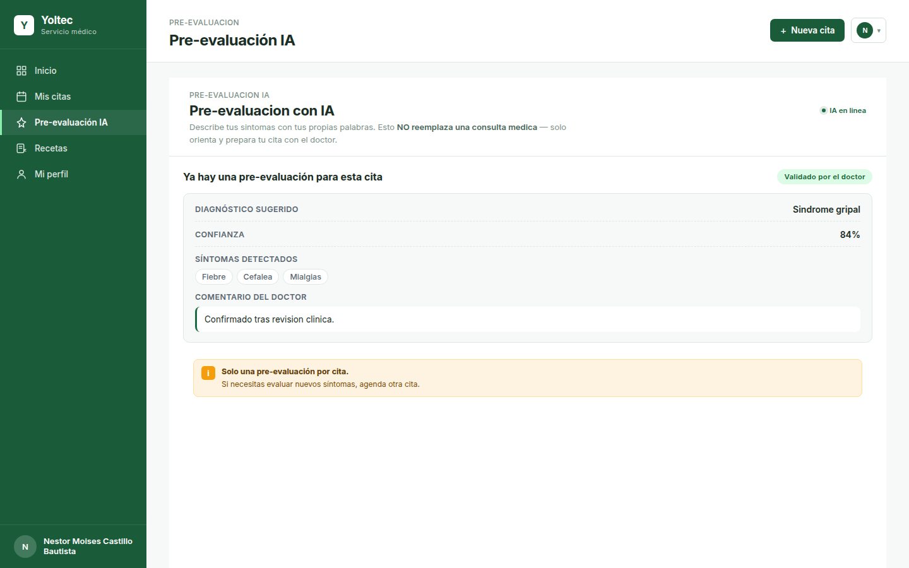</td>
<td width="50%">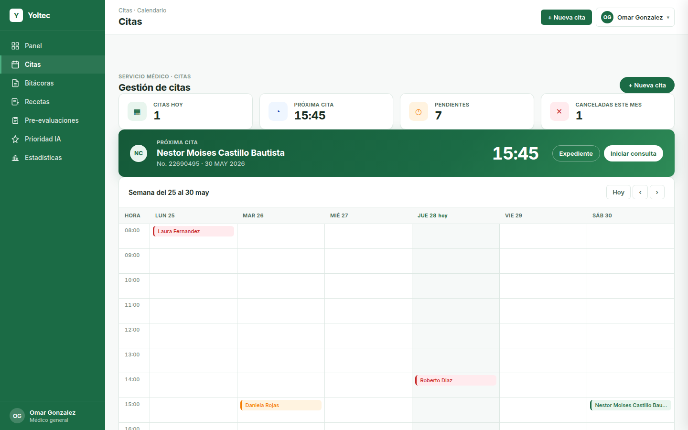</td>
</tr>
</table>
</div>

---

## Sobre el proyecto

Yoltec digitaliza el flujo completo del consultorio médico universitario: agendado, atención, recetas, historial y reportes. Integra **dos modelos de inteligencia artificial** que asisten al doctor sin sustituirlo:

- **Clasificador de prioridad** (`scikit-learn`, `HistGradientBoostingClassifier`): predice riesgo de inasistencia a partir del historial del alumno. Reentrenado con dataset de 87 000 registros, precisión 86%.
- **Pre-evaluación conversacional** (`scikit-learn` + `Groq`/`Llama 3.1 8B` opcional): orienta al alumno antes de la consulta, sugiere diagnóstico preliminar con porcentaje de confianza y aviso explícito de que **no sustituye al médico**. El diagnóstico lo da siempre el modelo propio; el LLM solo conduce la charla, y si no está disponible el chat sigue funcionando con un guion de preguntas y extracción de síntomas por reglas.

El sistema cubre tres roles (alumno, doctor, administrador) en web responsiva y una app móvil exclusiva para estudiantes.

---

## Características destacadas

- Tres roles con interfaz adaptada: alumno, doctor y administrador
- **Dos modelos de IA** integrados con validación humana obligatoria
- Calendario con disponibilidad real (slots de 15 min, días especiales, festivos)
- Recetas digitales sin generación de PDF (visualización directa)
- Bitácora del consultorio exportable a CSV
- Autenticación con **Laravel Sanctum** + **2FA** por correo para doctores y admin
- Modo oscuro nativo en web y móvil
- 100% responsivo (mobile-first en web)
- Rate limiting, headers de seguridad y CORS con allowlist
- Workflow de compilación y pruebas del entorno local en cada Pull Request

---

## Stack tecnológico

| Capa          | Tecnología                                                  |
| ------------- | ----------------------------------------------------------- |
| Backend       | Laravel 12 · PHP 8.4 · Sanctum                              |
| Frontend web  | Angular 20 · TypeScript · RxJS · Chart.js                   |
| App móvil     | Flutter 3.x · Dart 3 · Material 3                           |
| IA            | Python 3.12 · FastAPI · scikit-learn · Groq (Llama 3.1 8B)  |
| Base de datos | PostgreSQL (Neon, SSL)                                      |
| Notificaciones| Firebase Cloud Messaging                                    |
| Email         | Resend/SMTP (despliegues) · Mailpit (local)               |
| Infraestructura | Docker · Docker Compose · Render · Vercel                 |

---

## Arquitectura

```
┌─────────────────┐   ┌──────────────────┐   ┌──────────────────┐
│  Frontend web   │   │  App móvil       │   │  Admin (web)     │
│  Angular 20     │   │  Flutter 3.x     │   │  Angular 20      │
│  Doctor         │   │  Estudiantes     │   │  CRUD usuarios   │
└────────┬────────┘   └────────┬─────────┘   └────────┬─────────┘
         │                     │                      │
         └──────────────┬──────┴───────┬──────────────┘
                        │              │
                        ▼              ▼
                ┌──────────────────────────┐
                │   Backend Laravel 12     │
                │   API REST + Sanctum     │
                └────────┬─────────────────┘
                         │
              ┌──────────┴──────────┐
              ▼                     ▼
   ┌────────────────────┐   ┌────────────────────┐
   │  PostgreSQL Neon   │   │  Microservicio IA  │
   │  (cloud)           │   │  FastAPI + Groq    │
   └────────────────────┘   └────────────────────┘
```

---

## Capturas

### Web — Acceso

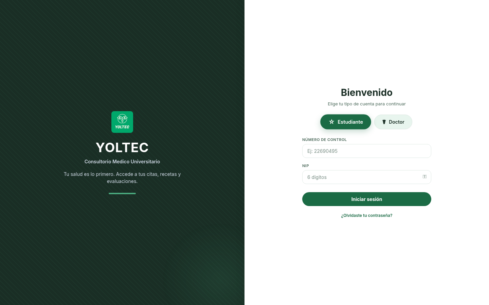

Login dual con selector de rol estudiante o doctor. El alumno ingresa con número de control y NIP de 6 dígitos; el doctor con usuario y contraseña. El acceso administrativo está oculto en `/acceso-gestion` y exige 2FA en producción.

### Web — Alumno

| Inicio | Mis citas |
|:-:|:-:|
| 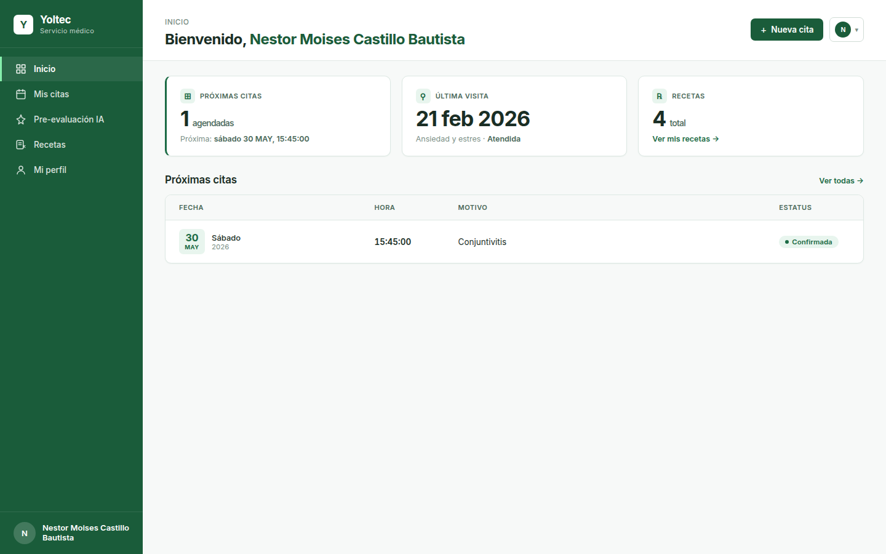 | 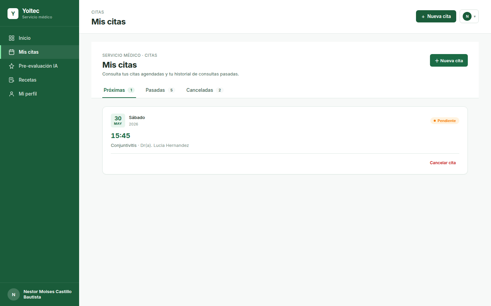 |

| Recetas | Perfil |
|:-:|:-:|
| 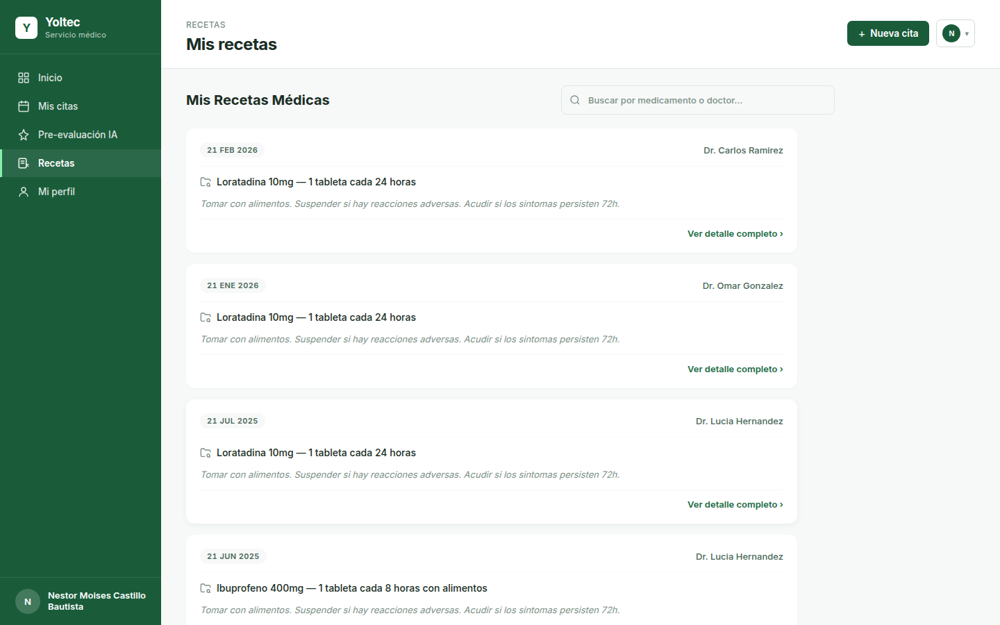 | 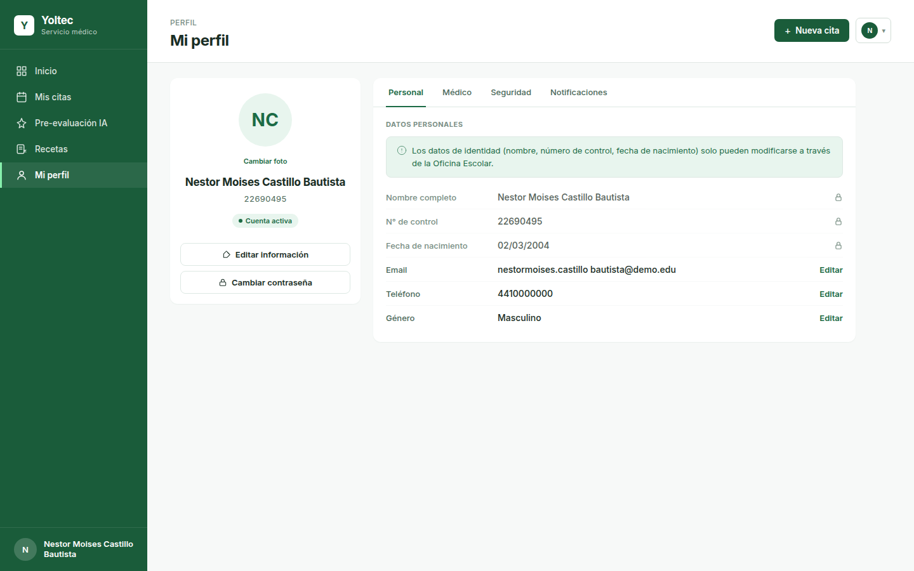 |

### Web — Doctor

| Bitácora | Pre-evaluaciones IA |
|:-:|:-:|
| 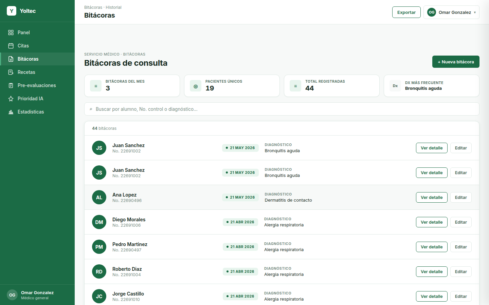 | 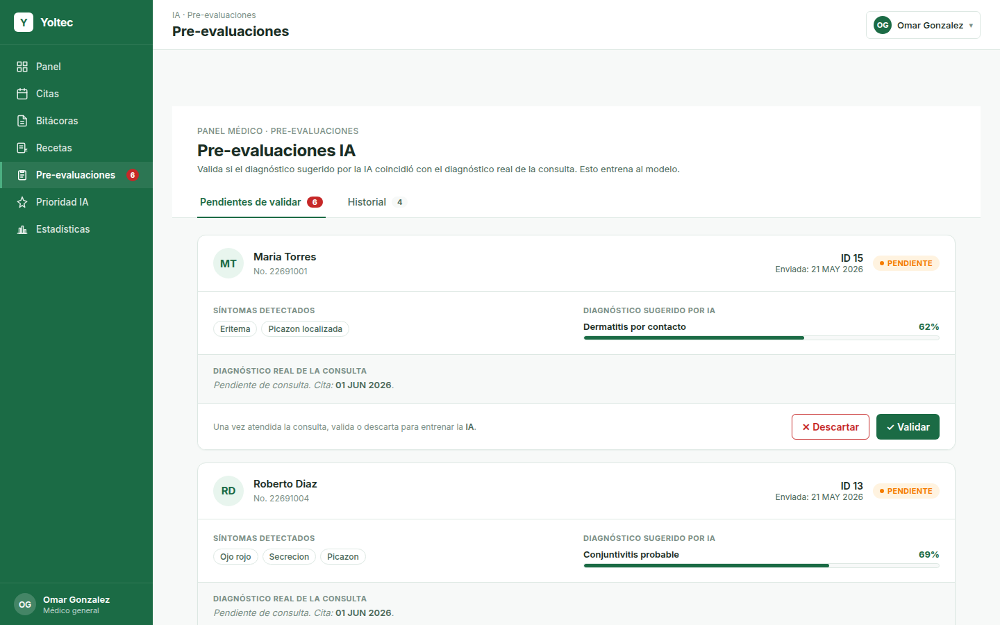 |

### Web — Administrador

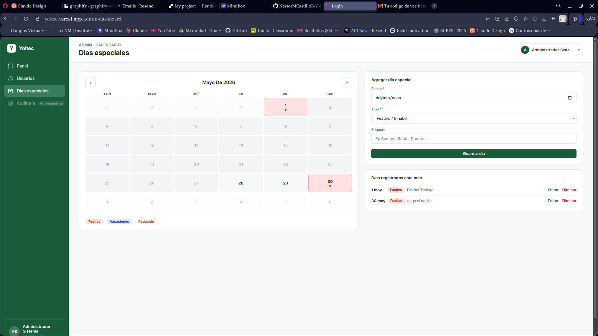

Gestión del calendario administrativo: días no laborables, festivos y horarios reducidos. El calendario respeta estas reglas al ofrecer disponibilidad a los alumnos.

### Móvil — Flutter (exclusivo alumno)

<table>
<tr>
<td>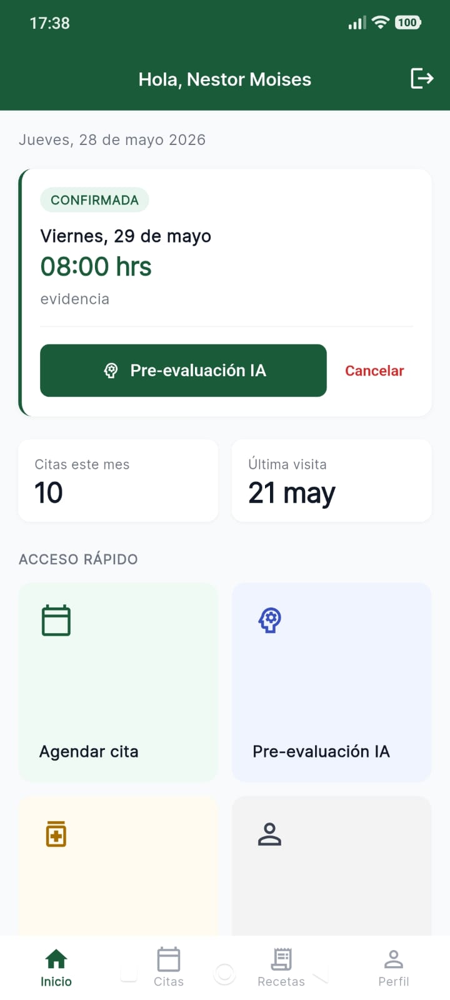</td>
<td>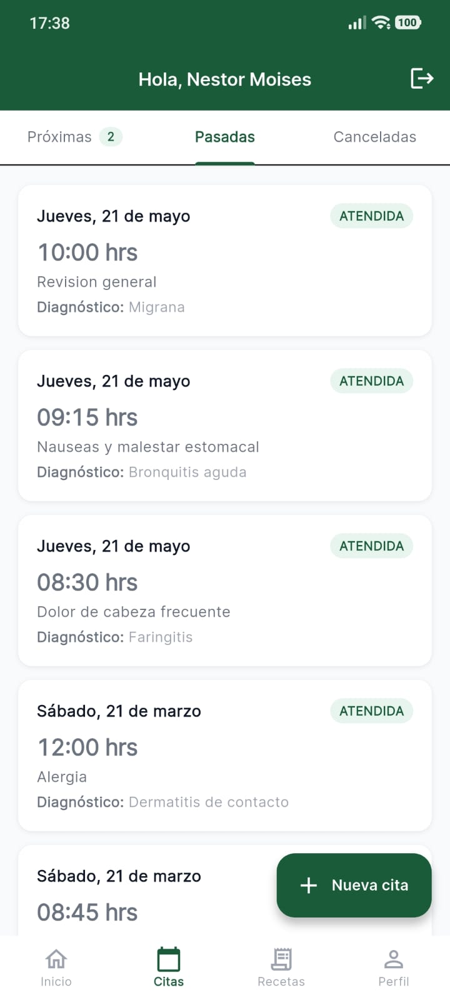</td>
<td>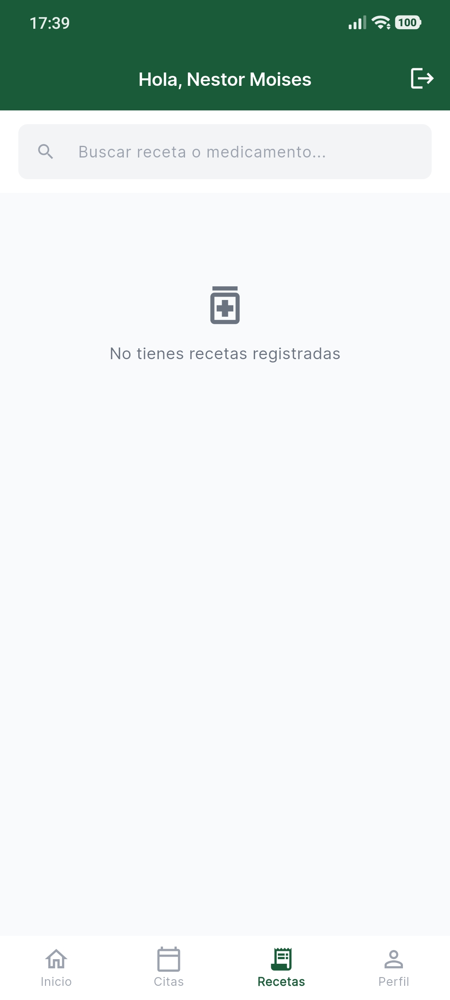</td>
<td>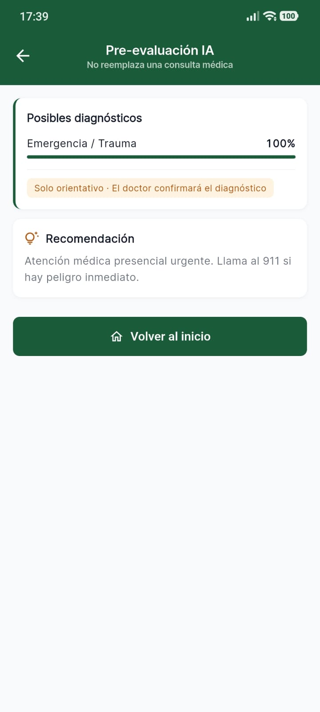</td>
</tr>
<tr>
<td align="center">Inicio</td>
<td align="center">Historial</td>
<td align="center">Recetas</td>
<td align="center">Pre-evaluación IA</td>
</tr>
</table>

### Móvil — Modo oscuro

<table>
<tr>
<td>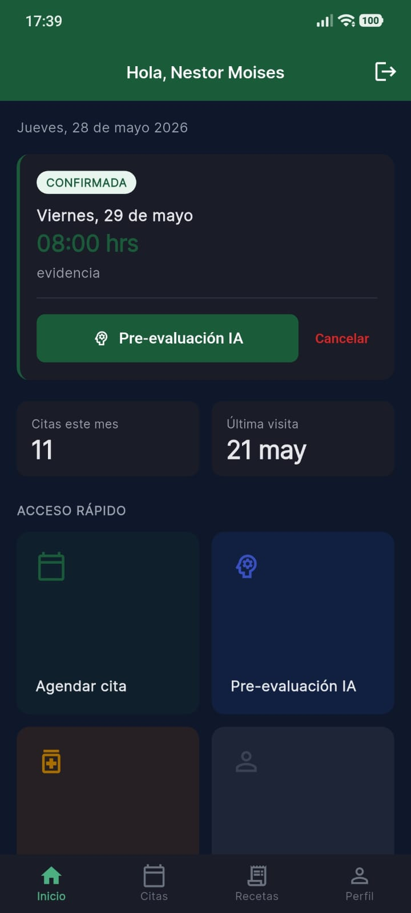</td>
<td>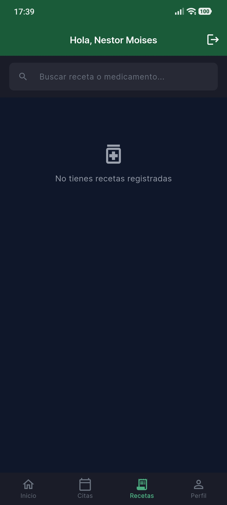</td>
</tr>
<tr>
<td align="center">Inicio</td>
<td align="center">Recetas</td>
</tr>
</table>

---

## Roles y funcionalidades

### Estudiante (app móvil)
- Login con número de control + NIP de 6 dígitos.
- Calendario de citas (Lun–Sáb, 8:00–17:00, slots de 15 min).
- Pre-evaluación conversacional con IA, asociada a la próxima cita.
- Historial de citas (Próximas / Pasadas / Canceladas).
- Recetas con detalle de medicación.
- Perfil médico editable (alergias, crónicas, contacto de emergencia).

### Doctor (web)
- Login con usuario + contraseña + 2FA por correo en producción.
- Dashboard con KPIs en tiempo real (citas, atendidas, asistencia).
- Validación de diagnósticos de pre-evaluación generados por IA.
- Creación de consultas, bitácoras y recetas.
- Agendar y cancelar citas a nombre de alumnos.
- Clasificador de prioridad por paciente.
- Exportación de bitácora a CSV.

### Administrador (web, ruta oculta)
- CRUD de alumnos y doctores.
- Gestión del calendario (días especiales, cierres).
- Acceso vía `/acceso-gestion` (no enlazado desde el login público).
- 2FA obligatorio también en el entorno local.

---

## Instalación

Para desarrollar sin las credenciales antiguas, sigue la
[guía de desarrollo local](docs/desarrollo-local.md). Requiere Docker Engine,
Compose, Bash y OpenSSL.

```bash
./local.sh up
./local.sh seed
```

Esto crea PostgreSQL local, construye Laravel y Angular, inicia la IA y prepara
un buzón Mailpit para probar correo y 2FA. No utiliza los `.env` heredados ni
conecta a Neon. La primera construcción descarga las dependencias.

| Servicio | URL local |
| --- | --- |
| Aplicación | http://localhost:4200 |
| Backend | http://localhost:8000/api/health |
| Correo de prueba | http://localhost:8025 |
| IA | http://localhost:5000/health |

La IA funciona sin clave de Groq: el chat pasa a modo guiado y sigue
entregando diagnóstico. Consulta las cuentas ficticias y los pasos de 2FA en la guía.

Pruebas: `./local.sh test`. Detener conservando datos: `./local.sh down`.

El arranque nativo `./start.sh` necesita PHP 8.4 con sus extensiones, Composer,
Node compatible con Angular 20, Python 3.12 y una base PostgreSQL aislada,
configurados por separado. No ejecutes ese camino con los `.env` antiguos sin
revisar primero el destino de la conexión.

La configuración de Flutter se abordará por separado; este entorno levanta la
aplicación web, el backend y el microservicio de IA.

---

## Configuración de entorno

Cada subproyecto trae una plantilla de variables. El entorno Docker local genera
`.env.local`, ignorado por Git. Hubo credenciales expuestas en el historial:
retirarlas del árbol actual no sustituye su revocación en los proveedores.

| Variable                          | Dónde se usa | Cómo obtenerla                          |
| --------------------------------- | ------------ | --------------------------------------- |
| `APP_KEY`                         | Laravel      | `php artisan key:generate`              |
| `DB_HOST`, `DB_PASSWORD`          | Laravel      | Panel de Neon (o tu PostgreSQL)         |
| `GROQ_API_KEY`                    | IA           | https://console.groq.com                |
| `MAIL_USERNAME`, `MAIL_PASSWORD`  | Laravel      | Gmail App Password o Resend             |
| `FIREBASE_CREDENTIALS`            | Laravel      | Service account JSON desde Firebase     |

---

## Seguridad

- Contraseñas y NIPs almacenados con **bcrypt**.
- Tokens Sanctum con expiración de 24 h y purga automática diaria.
- **2FA por correo** obligatorio para doctores y administradores en producción.
- Rate limiting (`throttle:5,1`) en endpoints sensibles (login, 2FA, reset).
- CORS con allowlist explícita, sin wildcards en producción.
- Headers de seguridad (`SecurityHeaders` middleware): HSTS y X-Frame-Options. CSP pendiente de implementar.
- Para reportar vulnerabilidades: [`SECURITY.md`](SECURITY.md).

> Si necesitas credenciales de prueba (usuarios demo para reviewers), solicítalas al líder del proyecto. **No se publican en este README** porque la instancia desplegada es real y compartida.

---

## Despliegue

| Servicio | Plataforma | URL                                           |
| -------- | ---------- | --------------------------------------------- |
| Frontend | Vercel     | https://yoltec.vercel.app                     |
| Backend  | Render     | https://yoltec-backend.onrender.com           |
| IA       | Render     | https://yoltec-ia.onrender.com                |
| BD       | Neon       | privada                                       |

Los releases del APK móvil se publican en [GitHub Releases](https://github.com/NestorMCastilloB/Yoltec/releases).

---

## Estructura del repositorio

```
Yoltec/
├── backend/          Laravel 12 — API REST + IA de priorización
├── frontend/         Angular 20 — SPA web (alumno + doctor + admin)
├── mobile/           Flutter — App estudiante (Android)
├── IA/               Python + FastAPI — sklearn + Groq
├── docs/             Documentación técnica, capturas y entregables
├── docker-compose.yml
├── README.md
├── LICENSE
├── SECURITY.md
└── CONTRIBUTING.md
```

---

## Equipo

Proyecto desarrollado por estudiantes de **Ingeniería en Sistemas Computacionales** del Instituto Tecnológico Superior de Ciudad Valles (ITSV).

| Integrante                          | N.º de control | Rol                                  |
| ----------------------------------- | -------------- | ------------------------------------ |
| **Nestor Moisés Castillo Bautista** | 22694095       | **Líder del proyecto**               |
| Axel de Jesús Martínez Salazar      | 22690057       | Equipo de desarrollo                 |
| Mario Alberto Martínez Cruz         | 22690239       | Equipo de desarrollo                 |
| Erick Iván García Ortega            | 22690195       | Equipo de desarrollo                 |
| Julián García Villedas              | 22690208       | Equipo de desarrollo                 |

**Asesor académico:** Profesor Gómez Rodríguez Ismael — *Desarrollo de Aplicaciones Multiplataforma*.

---

## Contribuir

Lee primero [`CONTRIBUTING.md`](CONTRIBUTING.md) para conocer el flujo de ramas, convenciones y proceso de revisión.

```bash
git checkout main && git pull
git checkout -b feat/descripcion-corta
git add archivos_modificados
git commit -m "feat: descripción breve"
git push origin feat/descripcion-corta
# abrir PR hacia main
```

Convención de commits: `feat` · `fix` · `refactor` · `docs` · `chore` · `test`.

---

## Licencia

Distribuido bajo licencia **MIT**. Consulta [`LICENSE`](LICENSE) para más detalles.

---

<div align="center">
<sub>Proyecto académico · Instituto Tecnológico Superior de Ciudad Valles (ITSV) · 2026</sub>
</div>
